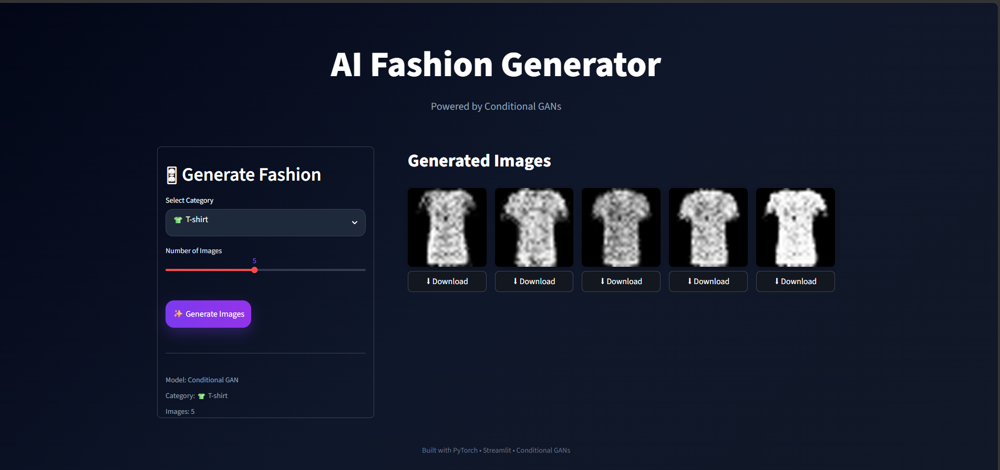

# ✨ AI Fashion Generator

AI-powered fashion image generation web application built using Conditional GANs (cGANs), PyTorch, and Streamlit.

Generate fashion items in real time with an interactive modern UI.

---

## 🚀 Features

- 👕 Generate AI fashion images using Conditional GANs
- 🎨 Real-time image synthesis
- ⚡ Interactive Streamlit web application
- 🌌 Modern dark-themed UI/UX
- 📥 Download generated outputs
- 🧠 Conditional label-based generation
- 🖼 Bicubic image upscaling for smoother visualization

---

## 🛠 Tech Stack

- Python
- PyTorch
- Streamlit
- TorchVision
- NumPy
- Pillow

---

## 📸 Screenshots

### Main Interface



---

## 🧠 Model Architecture

The project uses a Conditional GAN (cGAN) architecture:

- Random noise vector input
- Label embeddings for conditional generation
- Fully connected neural network generator
- Fashion-MNIST dataset for training

---

## 📂 Project Structure

```bash
AI-Fashion-Generator/
│
├── app.py
├── generator.pth
├── requirements.txt
├── README.md
│
└── assets/
    └── ui-preview.png
```

---

## ⚙ Installation

Clone the repository:

```bash
git clone https://github.com/YOUR_USERNAME/AI-Fashion-Generator.git
```

Move into the project directory:

```bash
cd AI-Fashion-Generator
```

Install dependencies:

```bash
pip install -r requirements.txt
```

Run the application:

```bash
streamlit run app.py
```

---

## 🎯 Future Improvements

- Higher resolution image generation
- DCGAN / StyleGAN implementation
- Better dataset support
- Image history gallery
- User customization controls
- Model deployment improvements

